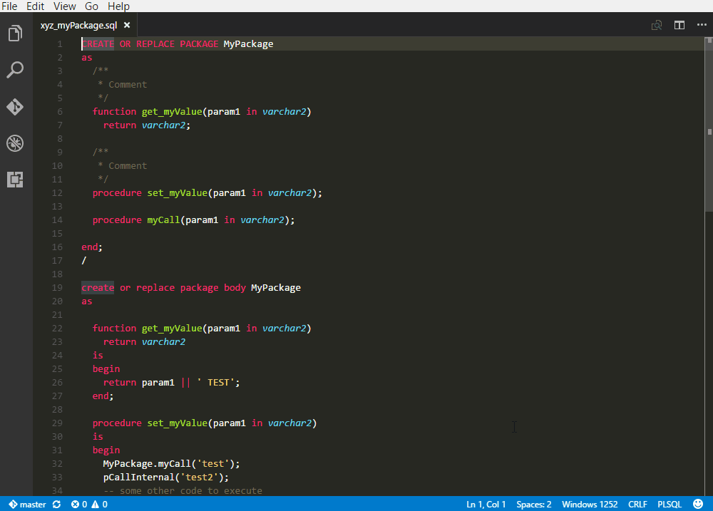
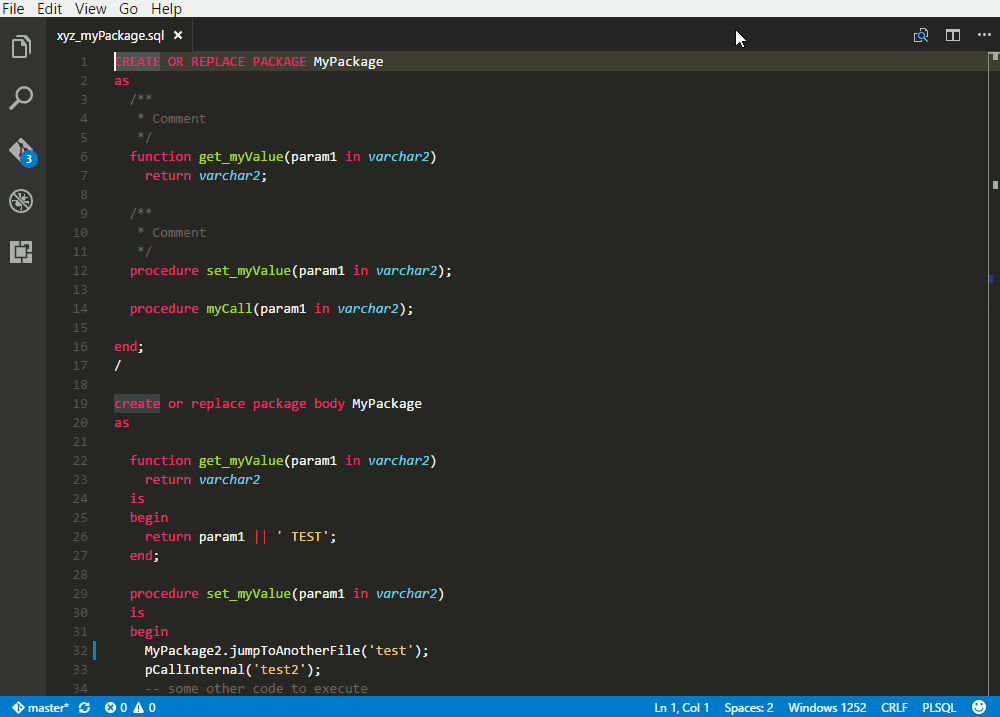

# PL/SQL (Oracle) for Visual Studio Code

This extension adds support for the PL/SQL (Oracle) to Visual Studio Code.

## Colorization
Full syntax highlight for PL/SQL files based on oracle-textmate-bundle

An advanced customization can be done by using an **extensionDependencies**, [follow this exemple](plsql-language-custom/xyz.plsql-language-custom-0.0.1)

## Go to Symbol
Navigate to methods (procedures and functions) inside a package file

## Go to Definition
Navigate to methods (procedures and functions) with some limitations :
- Go to a method in the same file
- Go to a method in another file whose name includes the package or method name.
   e.g.: *XXX_MyPackage.pkb or XXX_MyFunction.sql*

## Note
For this extension works with .sql files you must change your settings (user or workspace) like this:

        "files.associations": {
           	"*.sql": "plsql"
        }

## Compile / Task
You can compile a PLSQL package with sqlplus, create a task like this:

        {
            "version": "0.1.0",

            // The command is a shell script
            "isShellCommand": true,

            // Run sqlplus
            "command": "sqlplus",
            // Alternative (see below)
            // "command": "run_sqlplus.bat",

            "args": ["username/password@sid", "@\"${file}\""]
        }

To force sqlplus to complete, it is better to use a batch file like this:

        run_sqlplus.bat
                echo exit | echo show errors | sqlplus %1 %2

This will run sqlplus, output any errors, and then exit cleanly back to VS Code.
Thanks to @mortenbra (issue [#5](https://github.com/zabel-xyz/plsql-language/issues/5))
